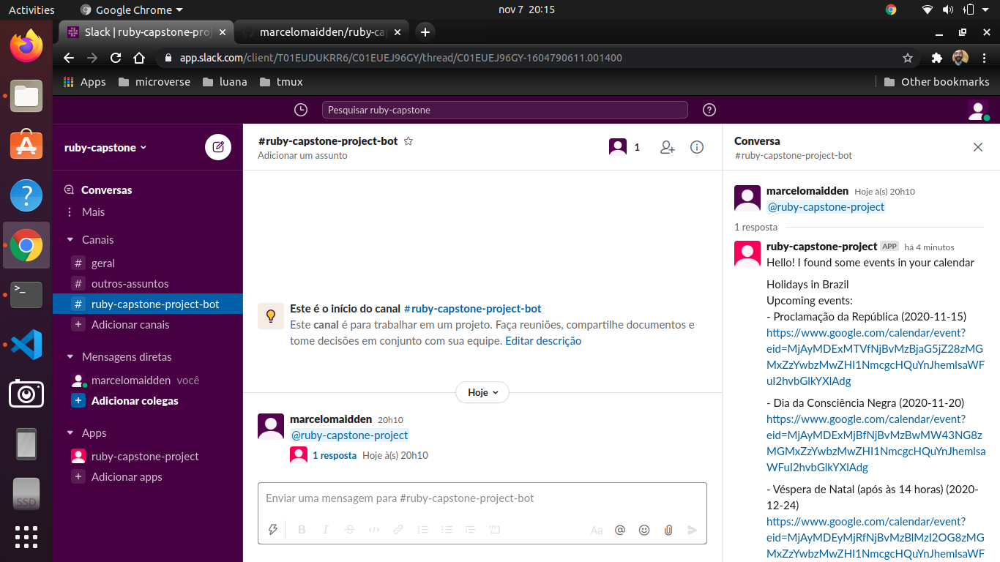

# Ruby Capstone Project
# Create your own BOT

# A project made in Ruby where I made a BOT to automatically answer for Slack messages

[Getting Started](#getting-started)

[Installation](#installation)

[Requirements](#requirements)

[Setting token](#set-environment-varible-token)

[Command to start the program](#command-to-start-the-program)

[Live demo](#live-demo)

[Author](#author)

[Acknowledgments](#acknowledgements)

[Contributing](#contributing)

[Show your support](#show-your-support)

[License](#license)

## Built With

- Ruby
- Slack Web API
- HTTParty

## Getting started
# In order to run the project locally follow all steps below:
Install git following the instructions available at [Git](https://git-scm.com/downloads)

Clone the repository typing the command below on your preferred terminal

    git clone https://github.com/marcelomaidden/ruby-capstone-bot/

After you have cloned the repository, enter the directory typing 
        
    cd ruby-capstone-bot

## Installation
Install ruby following the instructions available at [Ruby](https://www.ruby-lang.org/en/downloads/)

After that run bundle to install all needed Ruby packages

    bundle install

## Requirements

  - Add workspace to Slack
    - more information on [Slack workspace](https://slack.com/get-started#/create)
  - Create app on [Slack API](https://api.slack.com/apps) in your new workspace
  - Add features and functionalities listed above in order for it to work properly:
    - Bots
    - Permissions
  - Install your app to your workspace
  - Add Bot Token Scopes
      - Scopes
        - users:read
        - usergroups:read
        - channels:history
        - channels:read
        - chat:write
        - chat:write.public
        - groups:history
        - im:history
        - mpim:history

  - Invite ruby-capstone-bot by running the command below in a Slack conversation

    /invite ruby-capstone-project

  - Mention @ruby-capstone-project on a message

    @ruby-capstone-project hello

## Set environment variable token

# Linux

    export BOT_USER_OAUTH_ACCESS_TOKEN='string_token_from_bot_oauth_slack'

# Windows

    setx /m BOT_USER_OAUTH_ACCESS_TOKEN='string_token_from_bot_oauth_slack'

More information click [here](https://docs.microsoft.com/pt-br/windows-server/administration/windows-commands/setx)

## Command to start the program

  BOT_USER_OAUTH_ACCESS_TOKEN=BOT_USER_OAUTH_ACCESS_TOKEN ruby bin/run.rb 

## Live Demo

[Live Demo Link](https://repl.it/repls/EverlastingRequiredFunnel#README.md)

## How to test

## Author

**Marcelo Araújo**

- GitHub: [@marcelomaidden](https://github.com/marcelomaidden)
- Twitter: [@marcelomaidden](https://twitter.com/marcelomaidden)
- LinkedIn: [Marcelo Fernandes de Araújo](https://www.linkedin.com/in/marcelo-fernandes-de-ara%C3%BAjo-56700a171/)

## Acknowledgements
- Ruby creators

##  Contributing

Contributions, issues, and feature requests are welcome!

## Show your support

Give a ⭐️ if you like this project!

## License

This project is [MIT](./LICENSE) licensed.

